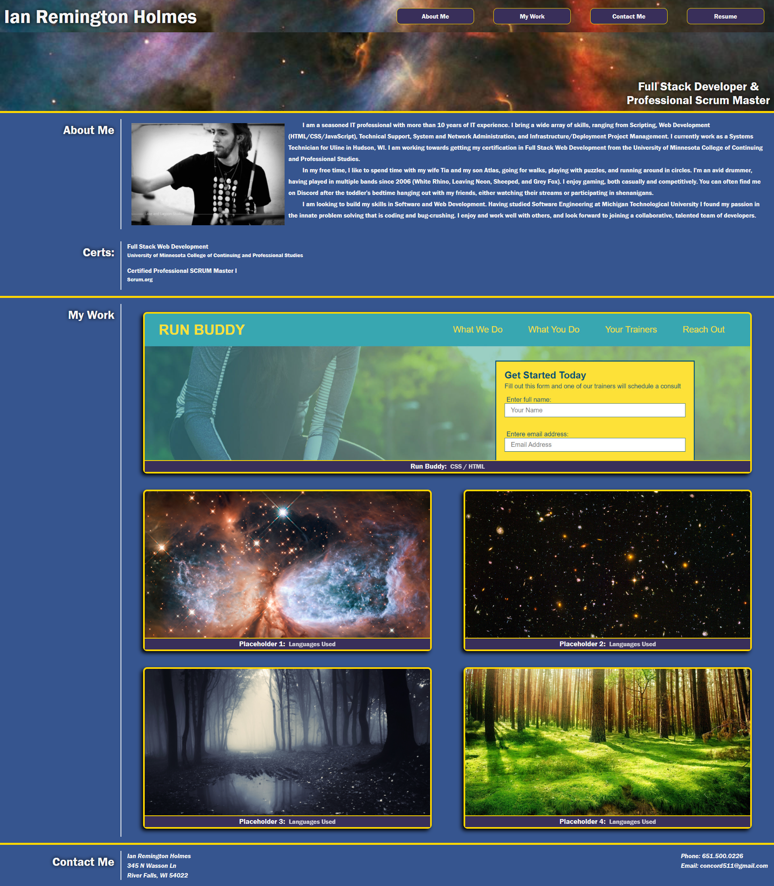

# Ian Holmes' Portfolio

This is my portfolio page with relevant sections to help a potential employer decide if I am a good fit for their company.

### About Me Section
- A section with a current photo, a description about me and my hobbies, and a list of current and relevant certifications.

### My Work Section
- A section with linkable images leading to deployed projects (or placeholders for future projects).

### Contact Me Section
- A section with my contact information should a potential employer wish to reach out to me.

### Resume Link

- A link to download my most current resume.

## The Page

A screenshot of the website:

A link to my live Portfolio: https://concord511.github.io/Portfolio/